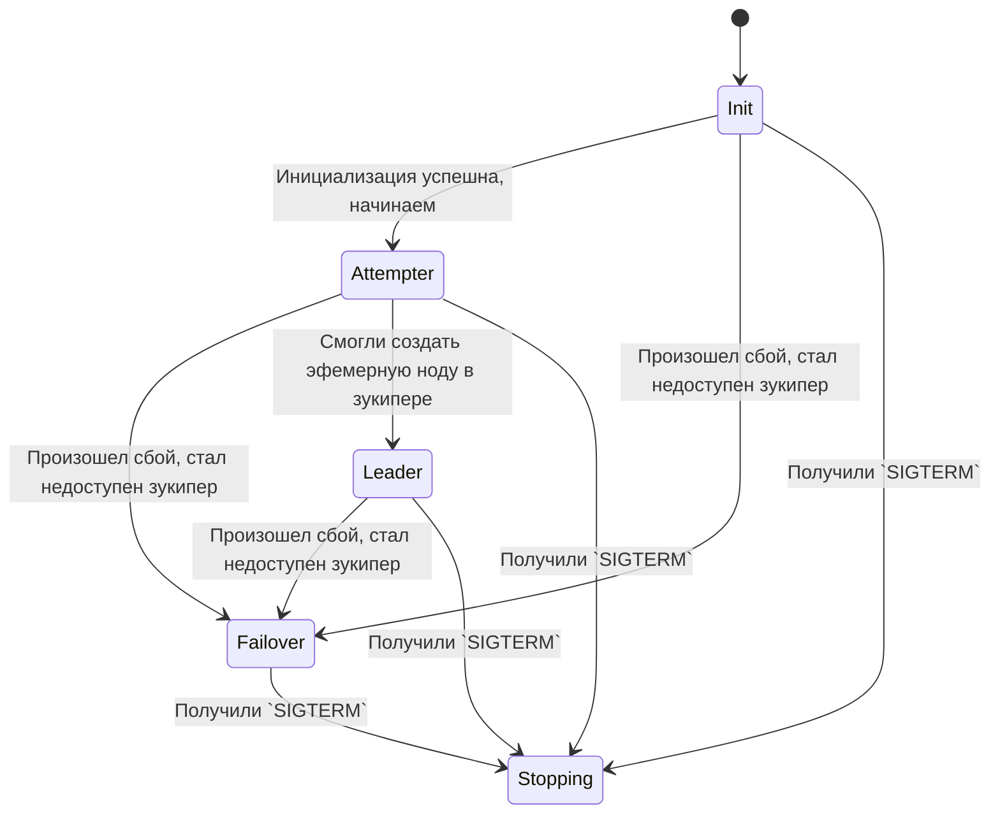

# ZooKeeper State Machine

Проект представляет собой стейт машину, которая существует в нескольких репликах,
и каждая реплика борется за лидерство.

Реплика, которая становится лидером, каждые `leader-timeout` секунд пишет файл в директорию `file-dir`,
а также удаляет старые файлы, если количество файлов в директории больше, чем `storage-capacity`.

Для выбора лидера используются эфемерные ноды ZooKeeper. Список состояний следующий:

- `Init` - Начинается инициализация, проверка доступности всех ресурсов
- `Attempter` - Попытка стать лидером - раз в `attempter-timeout` времени пытаемся создать эфемерную ноду в зукипере
- `Leader` - Стали лидером, пишем файл на диск (симуляция полезной деятельности)
- `Failover` - Что-то сломалось, попытка приложения починить самого себя
- `Stopping` - Graceful shutdown - состояние, в котором приложение освобождает все свои ресурсы



## Конфигурация

Конфигурирование проекта осуществляется через аргументы командной строки.
Также возможно конфигурирование через `.env` файл, тогда перед каждым
параметром необходимо добавить `ELECTION`. Пример: `--some-flag` --> `ELECTION_SOME_FLAG`

Список настроек:

- `zk-servers`(`[]string`) - Массив с адресами зукипер серверов. Пример: `--zk-servers=foo1.bar:2181,foo2.bar:2181`
- `leader-timeout`(`time.Duration`) - Периодичность записи лидером файлика на диск. Пример: `--leader-timeout=10s`
- `attempter-timeout`(`time.Duration`) - Периодичность с которой атемптер пытается стать лидером. Пример: `--attempter-timeout=10s`
- `file-dir`(`string`) - Директория, в которую лидер должен записывать файлики. Пример: `--file-dir=/tmp/election`
- `storage-capacity`(`int`) - Максимальное количество файлов в директории `file-dir`. Пример: `--storage-capacity=10`
- `failover-timeout`(`time.Duration`) - Периодичность, с которой фейловер пытается восстановить состояние машиы. Пример: `--failover-timeout=1s`
- `failover-attempts-count`(`int`) - Максимальное количество попыток фейловера восстановить состояние машины, после которого он перейдет в состояние `Stopping`. Пример: `--failover-attempts-count=10`

## Запуск

Для демонстрации работы можно сразу запустить готовый `compose.yml` файл из корня проекта.
Никакой конфигурации при этом прописывать не нужно.

```sh
docker compose up
```

По адресу `http://localhost:9000/` будет доступен ZooNavigator, который позволит отслеживать состояние zookeer'а